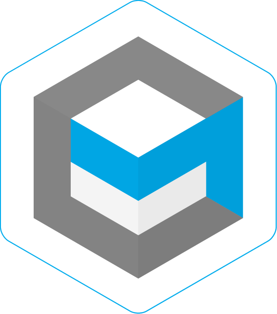

  

<h1 align="center">
  Komodo UI Mono Repository
   
</h1>

<h4 align="center">Decentralized applications with Komodo technologies.</h4>

## Project structure

- [packages/atomicdex-app](packages/atomicdex-app)
